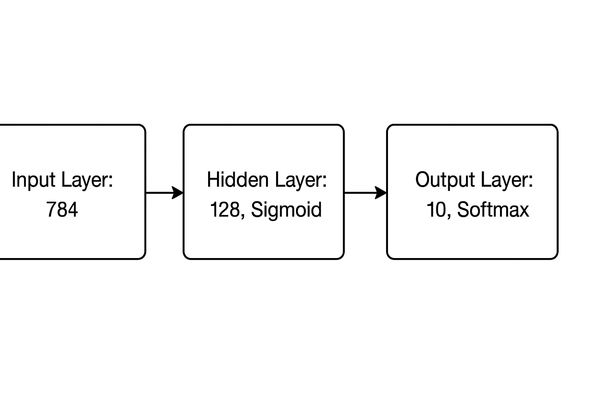

# NeuralNetworkMNIST

A Java-based implementation of a simple feedforward neural network from scratch for classifying handwritten digits (MNIST dataset in CSV format).

## 📂 Project Structure
- NeuralNetworkMNIST/
- │
- ├── data/  
- ├── src/ 
- ├── main/java/
- │ │ ├── Main.java
- │ │ ├── NeuralNetwork.java
- │ │ ├── Matrix.java
- │ │ ├── ActivationFunctions.java
- │ │ ├── DataLoader.java
- │ │ └── Utils.java
- ├── .gitignore 
- ├── README.md 
- └── NeuralNetworkMNIST.iml

## ✨ Features
- Neural network **implemented fully from scratch** (no ML libraries).
- Supports **training and testing** on MNIST CSV dataset.
- **Softmax + Cross Entropy Loss** at output layer.
- Shuffling & mini-batch gradient descent.
- Modular and extensible code design.

## 🧠 Neural Network Architecture
- Input Layer: **784 neurons** (28×28 pixels)
- Hidden Layer: **128 neurons**, Sigmoid activation
- Output Layer: **10 neurons**, Softmax activation
- Loss: **Cross-Entropy**
- Optimizer: **Gradient Descent**



## 🚀 How to Run

1. **Install Java (JDK 8+ recommended).**

2. **Clone the repository:**
   ```bash
   git clone https://github.com/mohamedashref19/NeuralNetworkMNIST.git
   cd NeuralNetworkMNIST

## Compile the source code:
`javac -d out $(find src -name "*.java")`

## Run the program:
`java -cp out main.java.Main`

## Example Training Output

### Training started...
#### Epoch 1: Loss = 0.317066, Accuracy = 90.43%

#### Epoch 2: Loss = 0.167914, Accuracy = 94.97%

#### Epoch 3: Loss = 0.131158, Accuracy = 95.98%

#### Epoch 4: Loss = 0.111172, Accuracy = 96.61%
#### ...
#### Test results: Loss = 0.123311, Accuracy = 96.64%

## 📑 Dataset
#### The project uses the MNIST dataset in CSV format (placed in the data/ folder).

#### Each row represents one 28×28 grayscale image flattened into 784 values.

#### The first column is the label (digit 0–9).

#### Remaining 784 columns are pixel intensities (0–255).

##### Download MNIST CSV version:

[Kaggle MNIST CSV Dataset](https://www.kaggle.com/datasets/oddrationale/mnist-in-csv)

## Deliverables
### ✅ Java source code (with comments)

### ✅ README documentation

### ✅ Example training logs (accuracy & loss)

### ✅ Network diagram (see doc/)
 